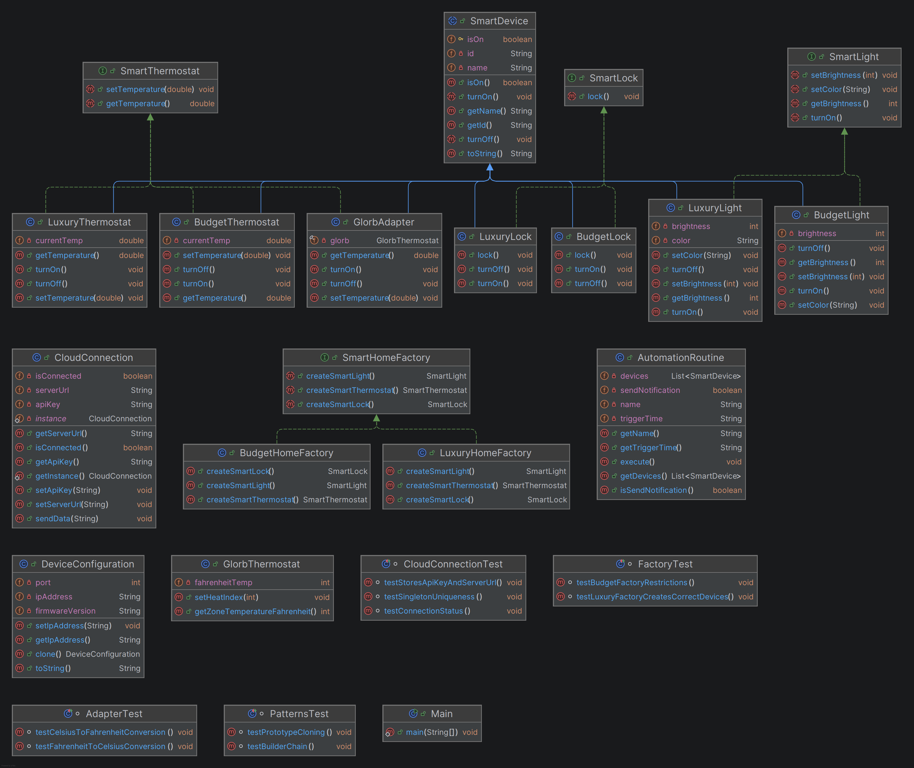

# OmniHome Smart System Integration – Lab 1

## Overview

OmniHome is a modular smart home backend system designed to manage diverse smart devices, legacy hardware, and automation routines.

Design patterns implemented:
- Singleton
- Abstract Factory
- Adapter
- Builder
- Prototype
- Factory Method (implicit within Abstract Factory)

The system simulates a smart home hub capable of connecting to a cloud service, deploying different device families, integrating legacy hardware, cloning configurations efficiently, and executing automation routines.

---

## UML Diagram

The UML diagram illustrates the relationships between interfaces, concrete device implementations, factories, adapters, configurations, and automation routines.
It was produced by IntelliJ IDEA.



The diagram shows:

- Inheritance hierarchy of smart devices
- Interface implementations for SmartLight, SmartThermostat, and SmartLock
- Abstract Factory structure creating Budget and Luxury device families
- Adapter relationship linking GlorbAdapter with GlorbThermostat
- Singleton cloud connection with single instance control
- Builder-created AutomationRoutine
- Prototype-based DeviceConfiguration cloning

---

## Project Structure

```text
Lab1/
│
├── OmniHome/
│   ├── automation/
│   │   └── AutomationRoutine.java
│   │
│   ├── config/
│   │   └── DeviceConfiguration.java
│   │
│   ├── connection/
│   │   └── CloudConnection.java
│   │
│   ├── devices/
│   │   ├── LuxuryLight.java
│   │   ├── BudgetLight.java
│   │   ├── LuxuryThermostat.java
│   │   ├── BudgetThermostat.java
│   │   ├── LuxuryLock.java
│   │   └── BudgetLock.java
│   │
│   ├── factories/
│   │   ├── SmartHomeFactory.java
│   │   ├── LuxuryHomeFactory.java
│   │   └── BudgetHomeFactory.java
│   │
│   ├── interfaces/
│   │   ├── SmartDevice.java
│   │   ├── SmartLight.java
│   │   ├── SmartThermostat.java
│   │   └── SmartLock.java
│   │
│   ├── legacy/
│   │   ├── GlorbThermostat.java
│   │   └── GlorbAdapter.java
│   │
│   ├── test/
│   │   ├── AdapterTest.java
│   │   ├── CloudConnectionTest.java
│   │   ├── FactoryTest.java
│   │   └── PatternsTest.java
│   │
│   └── Main.java
│
├── assets/
│   └── UML_Diagram.png
│
├── .gitignore
└── README.md

```

## Design Pattern Implementations

### 1. Singleton Pattern — CloudConnection

**Class:** `connection/CloudConnection.java`

**Purpose:** Ensures only one `CloudConnection` instance exists.

**Features:**
- Thread-safe using double-checked locking
- Stores `apiKey` and `serverUrl`
- Provides centralized cloud communication

**Verified by:**
- Printing memory addresses in `Main.java`
- JUnit test `CloudConnectionTest`

### 2. Abstract Factory Pattern — Device Families

**Classes:**
- `factories/SmartHomeFactory.java`
- `factories/LuxuryHomeFactory.java`
- `factories/BudgetHomeFactory.java`

**Purpose:** Creates complete families of related devices.

**Product interfaces:**
- `SmartLight`
- `SmartThermostat`
- `SmartLock`

**Concrete families:**

- **LuxuryLine:**
  - `LuxuryLight`
  - `LuxuryThermostat`
  - `LuxuryLock`

- **BudgetLine:**
  - `BudgetLight`
  - `BudgetThermostat`
  - `BudgetLock`

**Benefit:** Allows the system to switch entire product families easily.

### 3. Adapter Pattern — Legacy Thermostat Integration

**Classes:**
- `legacy/GlorbThermostat.java`
- `legacy/GlorbAdapter.java`

**Problem:**
Legacy `GlorbThermostat` uses:
- Fahrenheit instead of Celsius
- `int` instead of `double`
- Different method names

**Solution:**
`GlorbAdapter` converts Celsius input into Fahrenheit and forwards calls to `GlorbThermostat`.

**Benefit:** Allows legacy hardware to operate inside the modern system without modification.

### 4. Builder Pattern — AutomationRoutine

**Class:** `automation/AutomationRoutine.java`

**Purpose:** Allows flexible creation of `AutomationRoutine` objects.

**Routine properties:**
- `name`
- `devices`
- `triggerTime`
- `sendNotification`

**Builder methods:**
- `withName()`
- `addDevice()`
- `atTime()`
- `toggleNotification()`
- `build()`

**Benefit:** Avoids complex constructors and ensures valid routine creation.

### 5. Prototype Pattern — DeviceConfiguration

**Class:** `config/DeviceConfiguration.java`

**Purpose:** Allows fast cloning of device configurations.

**Configuration properties:**
- `ipAddress`
- `port`
- `firmwareVersion`

**Benefit:** Cloning enables reuse of existing configurations while allowing independent modification.

**Verification:** Verified by JUnit test ensuring original configuration remains unchanged.

### 6. Factory Method Pattern — Implicit

**Location:** Factory methods exist inside:
- `LuxuryHomeFactory`
- `BudgetHomeFactory`

**Methods:**
- `createSmartLight()`
- `createSmartThermostat()`
- `createSmartLock()`

**Purpose:** Encapsulate object creation logic.

---

## Unit Testing

JUnit 5 tests verify correct implementation of all patterns.

**Location:** `OmniHome/test/`

**Test coverage:**

| Test Class | Verifies |
| :--- | :--- |
| `CloudConnectionTest` | Singleton uniqueness and connection state |
| `FactoryTest` | Correct device family creation |
| `AdapterTest` | Celsius/Fahrenheit conversion |
| `PatternsTest` | Builder and Prototype behavior |

---

## Main Execution Flow

**File:** `OmniHome/Main.java`

**Simulation demonstrates complete system behavior:**

1. Establish Singleton `CloudConnection` and verify single instance
2. Create master `DeviceConfiguration` and clone it (Prototype)
3. Create LuxuryLine device family using Abstract Factory:
   - `LuxuryLight`
   - `LuxuryThermostat`
   - `LuxuryLock`
4. Integrate legacy `GlorbThermostat` using Adapter
5. Build `AutomationRoutine` using Builder with multiple devices and notification enabled
6. Execute `AutomationRoutine` to activate devices
7. Perform manual device control